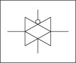

Transmission gates are used in digital circuits to pass or block particular signal from the components. In transmission gates, NMOS and PMOS are parallel connected to each other. Schematic representation of transmission gate and its circuit symbol are shown below.

In the **transmission gates** the input to the gate acts as the controlling input and depending on the value of control variable, the input at the source end of transistor appears at the drain end or in other words the control variable controls a transmission gate to which pass variables are applied. In figure shown above A is the control signal.

**Pass transistor logic is an efficient alternative to Complementary CMOS logic design because of following reasons:**

1. Decreased node capacitance

2. Reduced transistor count required to implement a logic function

3. Due to the low voltage swing pass transistors require lower switching energy to charge up the node

4. Better speed

5. Low power design

6. No static power consumption

**Applications of Transmission Gate :**

1. Transmission gates are typically used as building blocks for logic circuitry, such as a D Latch or D Flip-Flop

2. Transmission gates are basic building block for multiplexer

3. Transmission gates can be used for blocking particular component from live signal

**Multiplexer**

Multiplexer or MUX, which is also known as data selector, is a combinational circuit with multiple input and single output. At a time a single input is selected and given as output based on select signal.

A multiplexer selects binary information present on any one on the input line, depending upon logic status of the selection inputs and routes to the output line. If there are n selection line then number of possible routes input lines is 2n and then multiplexer is referred as a 2n x 1 multiplexer.

**Advantages of Multiplexer based on pass transistor:**

1. Pass transistor multiplexer uses fewer transistors as compared to fully complementary gates

2. Pass transistor is somewhat faster than complementary switch  

