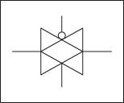
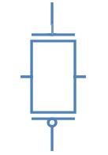
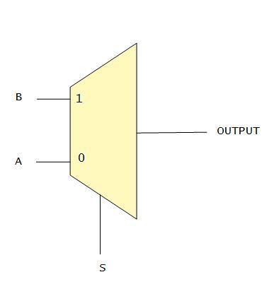
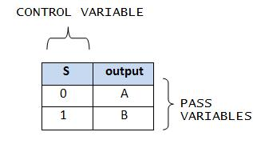
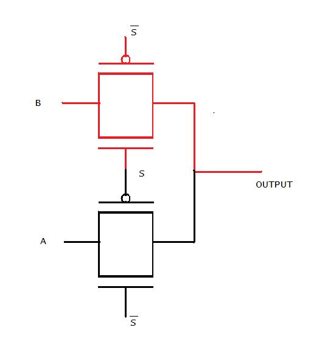

**TRANSMISSION GATE AND PASS TRANSISTOR LOGIC**

Transmission gates are used in digital circuits to pass or block particular signals. In transmission gates, NMOS and PMOS are connected in parallel. Schematic representation and circuit symbol:

In transmission gates, the input acts as the controlling input. Depending on the value of the control variable, the input at the source end of the transistor appears at the drain end. The control variable controls the transmission gate to which pass variables are applied. In the figure above, A is the control signal.

**Applications of Transmission Gate:**

1. Building blocks for logic circuitry (e.g., D Latch, D Flip-Flop)
2. Basic building block for multiplexers
3. Used for blocking particular components from live signals

**Advantages of Pass Transistor Logic over Complementary CMOS:**

1. Decreased node capacitance
2. Reduced transistor count for logic functions
3. Lower switching energy due to low voltage swing
4. Better speed
5. Low power design
6. No static power consumption

**PASS TRANSISTOR LOGIC THROUGH NMOS**

As we already know NMOS permits flow of current from source to drain when the input to the gate is 1 therefore when control variable is equal to 1 the input at the source end appears on the drain.

| IN  | CONTROL | OUT |
| --- | ------- | --- |
| 0   | 0       | X   |
| 1   | 0       | X   |
| 0   | 1       | 0   |
| 1   | 1       | 1   |

**PASS TRANSISTOR LOGIC THROUGH PMOS**

As we already know PMOS permits flow of current from source to drain when the input to the gate is 0 therefore when control variable is equal to 0 the input at the source end appears on the drain.

| IN  | CONTROL | OUT |
| --- | ------- | --- |
| 0   | 0       | 0   |
| 1   | 0       | 1   |
| 0   | 1       | X   |
| 1   | 1       | X   |

The above shown pass transistor will now be able to give a good one as well as good zero. At the time when S=1, both will be able to pass so whether the input signal is zero or one it will be passed almost as it is.

**MULTIPLEXER**

The multiplexer selects one of many analog or digital input. A multiplexer with 2n input lines have n select lines. The select lines can either be 0 or 1. Depending on the binary number(formed by combination of 1s and 0s) at the select lines. One of the input is selected and it is passed on to the output.

The block diagram and truth table of the 2 input multiplexer is given below:

The logical expression for output can be **AS'+BS**. If we implement this logic using nands and nors then no. of transistor required would be 5. We can use the knowledge of pass transistors, control variables and pass variables.

- Choice of control variable and pass variable??

  Select input should be the control variable and data inputs can act as pass variables

- Whether to use nmos/pmos pass transistor ??

  Since nmos is preferable in passing logic 0 and pmos is preffered in passing logic 1. We use a combination of both with complementing control variables. This ensures that both are on simultaneously and any value applied at the input appears at the output

If select variable is 1, the upper combination of nmos and pmos is switched on and hence B is passed. Similarily if select variable is 0 A is passed.
